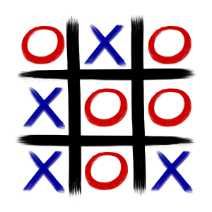
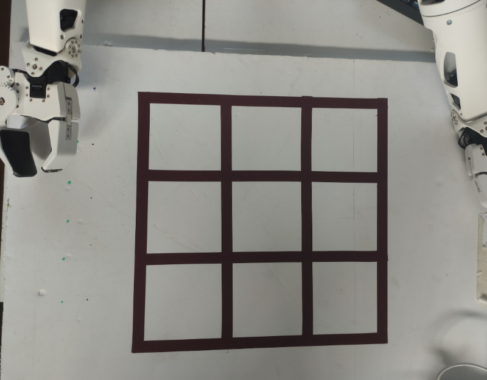
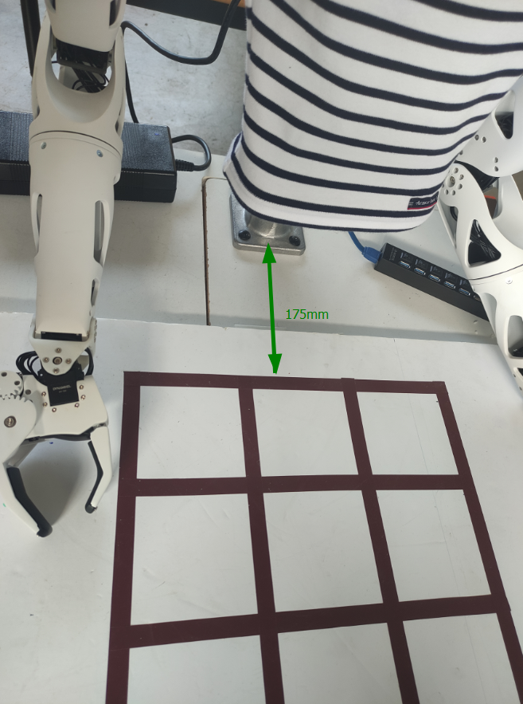
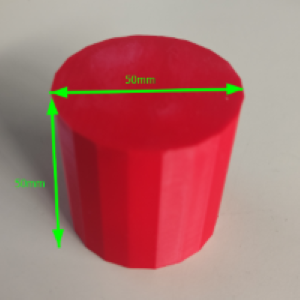
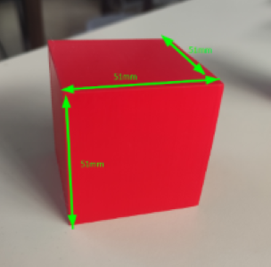
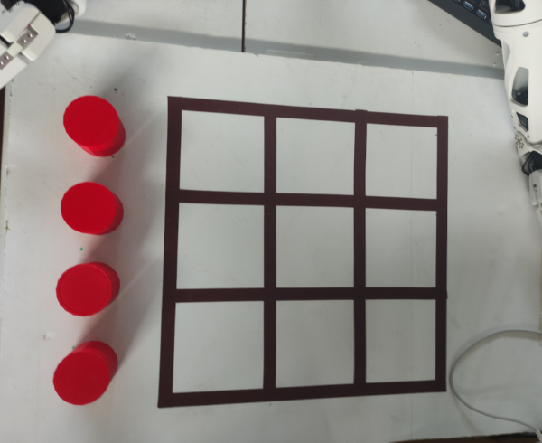

# tictactoe2021

| Classe de capsule  | &emsp;durée recommandée |
|:-------------------|:------------------|
| Task  &emsp;  ⚙️  |&emsp; 20 min      |


## 🎒 Prérequis

- Lycée et +

## Acquis d'apprentissage
A l'issue de cette activité, l'apprenant saura : 
- Entrainer un réseaux de neurones
- Utiliser systemctl  

## 📗 Documentation

Les informations de cette capsule sont tirées des liens suivants :   
[Le jeu du Tic-tac-toe](https://fr.wikipedia.org/wiki/Tic-tac-toe)   
[Playground configuration](https://www.notion.so/TicTacToe-Guide-26937009c5dc4a7f950ede22c918d85a)  
[Documentation Reachy 2019](https://pollen-robotics.github.io/reachy-2019-docs/)  
[Documentation Reachy 2021](https://docs.pollen-robotics.com/)


## Qu'est-ce que le jeu du Tic-tac-toe ❓ 
   
Pollen Robotics, l'entreprise créatrice de Reachy, a crée un programme capable de souligner l'interactivité de Reachy à la fois avec les humains et lors de la saisie et du déplacement d'objets : le Tic-tac-toe. 
Le tic-tac-toe, aussi appelé « morpion » (par analogie au jeu de morpion) et « oxo » en Belgique, est un jeu de réflexion se pratiquant à deux joueurs au tour par tour dont le but est de créer le premier un alignement. Le jeu se joue généralement avec papier et crayon. 
Deux joueurs s'affrontent. Ils doivent remplir chacun à leur tour une case de la grille avec le symbole qui leur est attribué : O ou X. Le gagnant est celui qui arrive à aligner trois symboles identiques, horizontalement, verticalement ou en diagonale.
  

## Travail effectué 
  
Lors de la migration du robot de du SDK 2019 au SDK 2021, beaucoup de commandes on changer et ont donc rendu impossible l'execution du jeu du Tic-tac-toe sur Reachy 2021. 
J'ai donc adapter le code pour Reachy 2021 notamment sur des changement assez significatifs tel que : 
* `reachy.r_arm.shoulder_pitch` : l'attribu right_arm de l'objet reachy à changer vers r_arm. Cela entraine donc un changement dans tout le code au niveau des déplacement du robot. 

* La méthode de l'objet reachy `goto()` devient une fonction externe : 
Au lieu de faire cela :  
```python
reachy.right_arm.elbow_pitch.goto(
    goal_position=90,  # in degrees
    duration=2,  # in seconds
    wait=True,
)
```
On a maintenant : 
```python
goto(
	goal_positions={reachy.r_arm.r_elbow_pitch: -90,}
	duration=1.0,
	interpolation_mode=InterpolationMode.MINIMUM_JERK
	)
```

* On utilise également maintenant la méthode turn_on() pour mettre non compliant tout un système de reachy : 
`reachy.turn_on('r_arm')`

* l'objet reachy.r_arm n'est plus itérable : 
`for joints in reachy.right_arm : `

## Configuration nécessaire 

Pour faire fonctionner le jeu une configuration particulière est nécessaire : 
* avoir au moins un bras droit sur Reachy pour déplacer les pions
* avoir une tête avec des caméras pour pouvoir regarder et analyser le playground

Pour mettre en place le Tic-tac-toe il te faudra : 
- Un robot reachy avec la configuration énoncée ci-dessus. 
- Un playground composé de : une planche en bois ou en liège (de la métière de votre choix), 5 cylindres, 5 cubes et du chaterton noir ou marron. 

### Mise en place du playground 

Pour pouvoir jouer au morpion avec Reachy il te faudra tout d'abord construire un playground adapté : 

Pour cela il te faut une planche de 45 x 65 en bois, liège, carton plume ... etc. Dimensions [ici](https://www.notion.so/Dimensions-setup-morpion-a032f56eb2f14702a75a1bb347bbd2dd)

1. Sur ta planche, il te faut placer le chaterton comme cela afin de créer ta grille :


2. Place la planche à 175 mm du pied du Reachy. Je te conseille de bien fixer la planche afin que le robot ne la déplace pas en jouant. 


3. Il te faut fabriquer ou acheter des cubes de 51 x 51mm et des cylindre de 50mm de diametre par 50mm de hauteur. Tu peux trouver ici des STL pour l'impression 3D de ces pièces :  
[Lien STL cylindre](https://github.com/ta18/tictactoe2021/blob/main/playground/cylinder.stl)  
[Lien STL cube](https://github.com/ta18/tictactoe2021/blob/main/playground/cube.stl)   
Il te faudra 5 pièces de chaque. 

 


### Première mise en route : 

1. Allume le robot. 
2. Tape la commande `sudo systemctl enable tictactoe_launcher.service` dans un terminal. 
3. Copier le fichier *tictactoe_launcher.service* dans /etc/systemd/system
5. Redémarre le robot. 
6. Attend pendant 30 secondes, le programme va se lancer seul et Reachy va commencer à jouer. 

### L'utilisation de systemctl 

Les commandes à connaitre : 
* `sudo systemctl stop tictactoe_launcher.service` : stop le service tictactoe 
* `sudo systemctl start tictactoe_launcher.service` : start le service tictactoe / lance le jeu 
* `sudo systemctl status tictactoe_launcher.service` : permet de voir l'etat du service, si il y a des erreurs ou non 
* `sudo systemctl enable tictactoe_launcher.service` : 
* `sudo systemctl disable tictactoe_launcher.service` : 

### Jouer avec Reachy 

La démo se déroule de manière totalement autonome : 
Le robot ne commencera une partie qu'une fois le plateau terminé. C'est à vous de réinitialiser la position de l'échiquier et de remettre les pions à leurs positions de base.
Positions de base : 


Lorsqu'une partie est terminée, une nouvelle est directement redémarrée. Ainsi, à la fin d'une partie, nettoyez le plateau et une nouvelle partie commencera.

Ensuite, si quelque chose d'étrange se produit pendant un jeu (comme quelqu'un qui triche, la détection était erronée et nous ne connaissons donc plus notre état actuel, etc.), le robot réinitialisera le jeu. Il effectuera un mouvement aléatoire, où Reachy renversera tous les pions présents sur le plateau. Il attendra alors le début d'une nouvelle partie, c'est-à-dire lorsque le plateau sera à nouveau nettoyé. Vous pouvez utiliser ce comportement pour réinitialiser le jeu quand vous le souhaitez.

Lorsque le plateau est prêt, le jeu commence. Reachy va désigner celui qui commence à l'aide son bras. Si il te montre, c'est à toi de commencer à jouer en plaçant un de tes pions (cubes). 
Une fois que tu as jouer Reachy va analyser le plateau en baissant la tête, il lui faut un peu de temps pour tout détecter, mais une fois que cela est bon il prendra tout seul sa pièce et jouera à son tour. 
ET ainsi de suite jusqu'a ce que quelqu'un gagne. 

### Adaptations a votre environnement 

Tu peux trouver 3 notebook dans le repository : 
* Collect_training_images.ipynb
* record_mouvements.ipynb
* test_formDetection_tf1.ipynb

Si tu souhaites adapter les mouvements du Reachy lors du tictactoe, tu peux utiliser le notebook *record_mouvements.ipynb* qui te permet d'enregistrer les mouvements tels que les mouvements pour poser les pièces au différentes cases.    
Si tu utilise les petites pièces il te faudra modifier la fermeture de la pinces pour permettre à Reachy de prendre une pièce. Pour cela, tu dois modifier le fichier *tictactoe_playground.py* qui se trouve dans /home/reachy/dev/tictactoe2021/reachy_tictactoe :    
[gripper](img/gripper.png)    
ligne : pince ouverte   
ligne : pince fermée   
ligne : pince ouverte   

Pour vérifier que le robot prendre en photo la totalité de la grille, utilise le notebook *test_formDetection_tf1.ipynb*.   
Pour tout ce qui est détection d'objet erroné, voir la section "Ré-entrainer un model".   

## Ré-entrainer un model 

Pour le jeu du tictactoe, j'utilise un réseau entrainé qui effectuer de la détection d'objets (ici detection de cube et cylindre). 
Le réseau est capable de détecter les formes cubique et cylindrique de petite et grande taille, et de couleurs différentes. Cependant, certaines couleurs qui se trouve plus près du blanc sont plus compliqué a détecter. En effet, la détection se fait grace à de la détection de contours : le réseau compare les pixels de couleurs. Donc si les pixels tire vers le blanc cela est difficile pour lui de faire la différence entre un pixel blanc et un pixel d'une couleur similaire. 
Si vous souhaitez utiliser le réseau que j'ai entrainé, vous pouvez utiliser des pièces petites et grandes, mais je vous conseille tout de même de prendre des couleurs qui sont plus proche du bleu, du rouge ou du vert foncé. 
De plus j'ai utiliser un playground blanc pour entrainer mon réseau, donc si vous utiliser un playground marron, noir ou d'une autre couleur vous deverez peut etre réentrainer le réseau. 

La configuration que je conseille pour eviter de ré entrainer le réseau est la suivante : 
- pièce de couleur bleu, rouge ou vert foncé 
- playground blanc 
- grille noir ou marron 

Si vous souhaitez re entrainer le réseau il vous faudra suivre le tutoriel suivant : 
[Retrain a SSH mobilnet model with Tensorflow 1 for EdgeTPU](https://github.com/ta18/tod_tf1)
